# Pokédex

## Introducción
Tenemos que crear una Pokédex como ejercicio de clase para PGV 2-DAM.
Aplicación web que consulta [PokéAPI](https://pokeapi.co/) y muestra información de Pokémon.


## 1. Punto de partida
Comenzamos creando el esqueleto del proyecto con sus carpetas y sus extensiones de archivo:

```
pokedex/
├── index.html
├── assets/
│   └── img/
│   └── sound/
├── css/
│   └── style.css
└── js/
    └── app.js
    └── pokemon.js
```

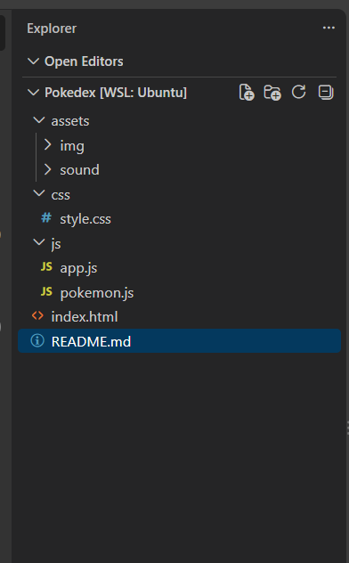

Tenemos la base del .html y .css que la profesora dejó preparado para empezar nuestra pokédex.

```html
<!DOCTYPE html>
<html lang="es">
<head>
  <meta charset="UTF-8">
  <meta name="viewport" content="width=device-width, initial-scale=1.0">
  <title>Mini-Pokédex</title>
  <link rel="stylesheet" href="css/style.css">
</head>
<body>
  <main class="contenedor">
    <h1>Mini-Pokédex</h1>

    <p class="introduccion">
      Introduce el nombre o el número de un Pokémon.
    </p>

    <form id="formulario-busqueda" class="buscador">
      <label for="busqueda">Nombre o número</label>

      <div class="buscador__controles">
        <input
          id="busqueda"
          name="busqueda"
          type="text"
          placeholder="Ejemplo: pikachu o 25"
          autocomplete="off"
        >

        <button type="submit">Buscar</button>
      </div>
    </form>

    <p id="mensaje" class="mensaje" aria-live="polite"></p>

    <section id="resultado" class="resultado"></section>
  </main>

  <script src="js/app.js"></script>
</body>
</html>
```
y su diseño básico en `.css`:
```css
* {
  box-sizing: border-box;
}

body {
  min-height: 100vh;
  margin: 0;
  padding: 2rem 1rem;
  font-family: Arial, sans-serif;
  color: #1f2937;
  background: #f3f4f6;
}

.contenedor {
  width: min(100%, 650px);
  margin: 0 auto;
}

h1 {
  margin-bottom: 0.5rem;
  text-align: center;
  color: #dc2626;
}

.introduccion {
  margin-bottom: 2rem;
  text-align: center;
}

.buscador {
  padding: 1.5rem;
  background: white;
  border-radius: 1rem;
  box-shadow: 0 8px 25px rgb(0 0 0 / 10%);
}

.buscador label {
  display: block;
  margin-bottom: 0.5rem;
  font-weight: bold;
}

.buscador__controles {
  display: flex;
  gap: 0.75rem;
}

.buscador input {
  flex: 1;
  min-width: 0;
  padding: 0.75rem;
  border: 2px solid #d1d5db;
  border-radius: 0.5rem;
  font: inherit;
}

.buscador input:focus {
  border-color: #dc2626;
  outline: 3px solid rgb(220 38 38 / 20%);
}

.buscador button {
  padding: 0.75rem 1.25rem;
  border: 0;
  border-radius: 0.5rem;
  color: white;
  font: inherit;
  font-weight: bold;
  background: #dc2626;
  cursor: pointer;
}

.buscador button:hover {
  background: #b91c1c;
}

.mensaje {
  min-height: 1.5rem;
  margin: 1.5rem 0;
  text-align: center;
  font-weight: bold;
}

.resultado {
  display: flex;
  justify-content: center;
}

.pokemon {
  width: min(100%, 360px);
  padding: 1.5rem;
  text-align: center;
  background: white;
  border-radius: 1rem;
  box-shadow: 0 8px 25px rgb(0 0 0 / 10%);
}

.pokemon__imagen {
  width: 180px;
  height: 180px;
  image-rendering: pixelated;
}

.pokemon__nombre {
  margin: 0.5rem 0;
  text-transform: capitalize;
}

.pokemon__numero {
  color: #6b7280;
  font-weight: bold;
}

.pokemon__datos {
  display: grid;
  grid-template-columns: repeat(2, 1fr);
  gap: 1rem;
  margin: 1.5rem 0;
}

.pokemon__datos p {
  margin: 0;
  padding: 0.75rem;
  background: #f3f4f6;
  border-radius: 0.5rem;
}

.pokemon__tipos {
  display: flex;
  flex-wrap: wrap;
  justify-content: center;
  gap: 0.5rem;
}

.tipo {
  padding: 0.4rem 0.8rem;
  color: white;
  text-transform: capitalize;
  background: #4b5563;
  border-radius: 999px;
}

@media (max-width: 480px) {
  .buscador__controles {
    flex-direction: column;
  }
}
```
Quedaría así para comenzar: 

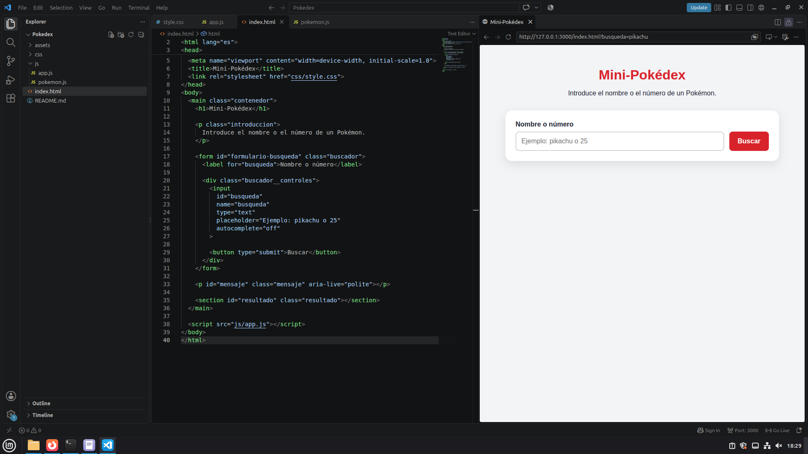

## 2 Construcción paso a paso

#### Paso 1. Estructura HTML y estilos

El HTML contiene tres elementos que usa JavaScript:

- Un **formulario** (`#formulario-busqueda`) con un campo de texto (`#busqueda`) y un botón. Se usa un formulario porque su evento `submit` salta tanto al pulsar el botón como al pulsar Enter, sin programar las dos cosas por separado.
- Un párrafo de **mensajes** (`#mensaje`) para avisar al usuario (errores).
- Una sección de **resultados** (`#resultado`) que empieza vacía. JavaScript insertará aquí la tarjeta.

El archivo `app.js` se carga al final del `body` para que el HTML ya exista cuando se ejecute el código.

#### Paso 2. Selección de elementos del DOM

JavaScript no puede modificar un elemento del HTML sin encontrarlo antes. Con `document.querySelector()` se busca un elemento mediante un selector CSS (`#` indica que se busca por `id`) y se guarda en una constante para reutilizarlo.

```js
const formulario = document.querySelector("#formulario-busqueda");
const inputBusqueda = document.querySelector("#busqueda");
const mensaje = document.querySelector("#mensaje");
const resultado = document.querySelector("#resultado");
```
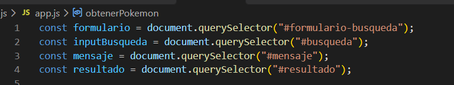

#### Paso 3. Escuchar el envío del formulario

Con `addEventListener` se indica qué código debe ejecutarse cuando ocurre un evento. Escuché el evento `submit` del formulario:

```js
formulario.addEventListener("submit", (evento) => {
  evento.preventDefault();
  
});
```

El comportamiento normal de un formulario es enviar los datos y recargar la página. `evento.preventDefault()` lo impide para que sea JavaScript quien controle el proceso.


#### Paso 4. Normalización de la búsqueda

El texto de un campo se obtiene con `.value`. Como el usuario puede escribir de cualquier forma (`PIKACHU`, `  pikachu  `), se limpia antes de usarlo:

- `trim()` elimina los espacios del principio y del final.
- `toLowerCase()` convierte el texto a minúsculas, que es como espera los nombres la API.

```js
const busqueda = inputBusqueda.value.trim().toLowerCase();
```

El resultado se guarda en una constante (`busqueda`). **Comprobación:** al escribir `   piKAChu   ` la consola mostró `pikachu`.
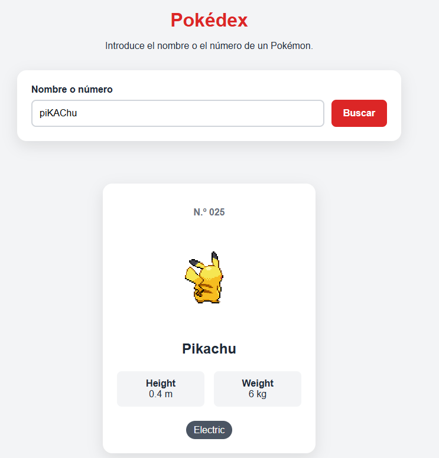

#### Paso 5. Validación de búsqueda vacía

Si el usuario no escribe nada, o solo espacios, `trim()` deja la cadena vacía (`""`), y no tiene sentido consultar la API. En JavaScript una cadena vacía se evalúa como "falso", así que `!busqueda` significa "si no hay búsqueda":

```js
if (!busqueda) {
  mensaje.textContent = "Tiene que poner nombre de pokémon o número";
  resultado.innerHTML = "";
  return;
}
```
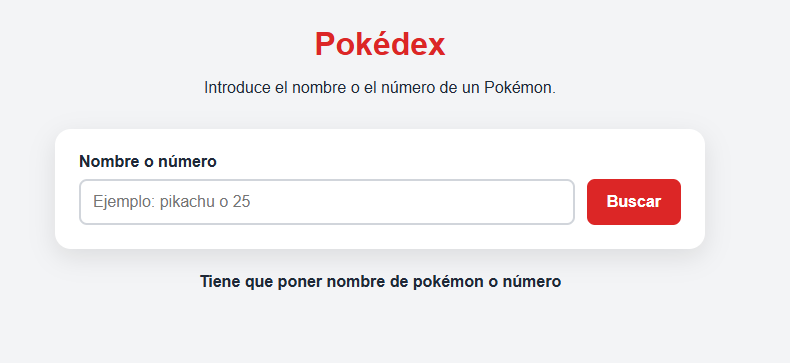

El bloque hace tres cosas:

1. Muestra un aviso con `textContent`.
2. Vacía la zona de resultados con `innerHTML = ""`, para que no quede una tarjeta de una búsqueda anterior.
3. Ejecuta `return`, que termina la función y evita que se ejecute el resto del código (la consulta a la API).

#### Paso 6. Consulta a PokéAPI

Creé una función aparte, `obtenerPokemon`, cuya única responsabilidad es consultar la API. Separar funciones hace el código más fácil de entender y de ampliar.

```js
const obtenerPokemon = async (busqueda) => {
  const url = `https://pokeapi.co/api/v2/pokemon/${busqueda}`;
  const respuesta = await fetch(url);
  const datos = await respuesta.json();

  return datos;
};
```
Conceptos utilizados:

- **`fetch(url)`** hace una petición HTTP. Tarda un tiempo, así que devuelve una promesa.
- **`await`** hace que la función espere a que la petición termine antes de continuar. Solo se puede usar dentro de funciones declaradas con `async`.
- **`respuesta.json()`** convierte el texto JSON recibido en un objeto de JavaScript. También hay que esperarlo con `await`.
- La URL se construye con una **plantilla literal** (acentos graves y `${}`), que permite insertar la variable dentro del texto.

Después, en el manejador del formulario, la función se llama con `await`, y por eso el manejador también tiene que ser `async`:

```js
formulario.addEventListener("submit", async (evento) => {
  // ...
  const pokemon = await obtenerPokemon(busqueda);
  console.log(pokemon);
});
```

El objeto que devuelve la API es enorme: Cuando `return datos` devuelve todos los datos del Pokemón, pero claramente no necesitamos todos. Entonoces nuestro return será:
```js
return {
        id: datos.id,
        name: datos.name,
        height: datos.height / 10 + " " + "m",
        weight: datos.weight / 10 + " " + "kg",
        image: datos.sprites.back_default,
        image2: datos.sprites.front_default,
        typess: datos.types.map(({ type }) => type.name),

    };
```
**`¡IMPORTANTE!`** Según criterios de la profesora, tenemos que tener en cuenta pedir a la API todo lo que necesitamos en una sola llamada. Luego ya la iremos colocando. Por eso todo lo que retornamos de la API.

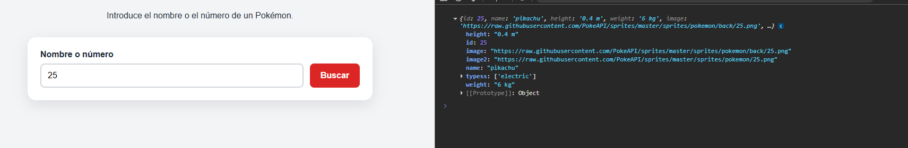

**Decisión de diseño:** las propiedades están en inglés para que el código sea legible por cualquier equipo de desarrollo.

**Conversión de unidades:** PokéAPI devuelve la altura en decímetros y el peso en hectogramos. Al dividir entre 10 se obtienen metros y kilogramos. La conversión se hace al construir el objeto, para que el resto del programa reciba los datos ya con sentido y no tenga que repetir la división. Además se concatena la unidad (`"m"`, `"kg"`) para que el dato se muestre listo.

**Imágenes:** guardo dos sprites, `image` (`back_default`, de espaldas) y `image2` (`front_default`, de frente). La tarea pide mostrar el de espaldas y cambiar al de frente al pasar el cursor. Como ya tengo las dos URL en el objeto, ese cambio no necesitará una nueva petición a la API.

**Comprobación:** Pikachu en la API tiene `height: 4` y `weight: 60`, y tras la conversión debe salir `"0.4 m"` y `"6 kg"`.

#### Paso 7. Control de errores en la consulta

`fetch()` no lanza un error cuando la API responde con un código como 404 (Pokémon inexistente): la petición "ha funcionado", aunque la respuesta sea negativa. Por eso hay que comprobar `respuesta.ok`, que vale `true` solo si el código HTTP está entre 200 y 299. Si no lo es, creo yo mismo un error con `throw`:

```js
const respuesta = await fetch(url);

if (!respuesta.ok) {
    throw new Error("Pokemon not found.");
}
```
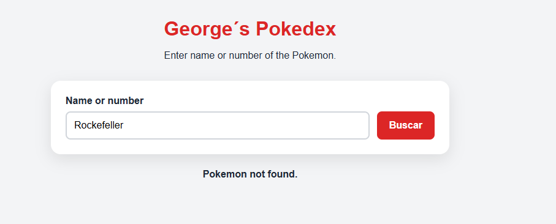

#### Paso 10. Tarjeta, mensaje de carga y `try/catch`


**a) Función `mostrarPokemon`.** Recibe el objeto del Pokémon y construye la tarjeta con una plantilla literal que se inserta en `resultado.innerHTML`. Los tipos se transforman en HTML con `map()` y `join("")`:

```js
const tiposHTML = pokemon.typess
    .map((type) => `<span class="tipo">${type}</span>`)
    .join("");
```

`map()` convierte cada nombre de tipo en un `<span>`, y `join("")` une los fragmentos sin las comas que añadiría por defecto un array al convertirse en texto.

**b) Función `formatearId`.** Añade ceros a la izquierda hasta tener tres dígitos, para que el número se vea como `N.º 025` en lugar de `N.º 25`:

```js
const formatearId = (id) => String(id).padStart(3, "0");
```
**c) Tarjeta.** Para ello contamos con innerHTML:
```html
resultado.innerHTML = `
    <article class="pokemon">
    
      <p class="pokemon__numero">N.º ${formatearId(pokemon.id)}</p>

      

      <h2 class="pokemon__nombre">${pokemon.name}</h2>

      <div class="pokemon__datos">
        <p><strong>Height</strong><br>${pokemon.height}</p>
        <p><strong>Weight</strong><br>${pokemon.weight}</p>
      </div>

      <div class="pokemon__tipos">
        ${tiposHTML}
      </div>
    </article>
```
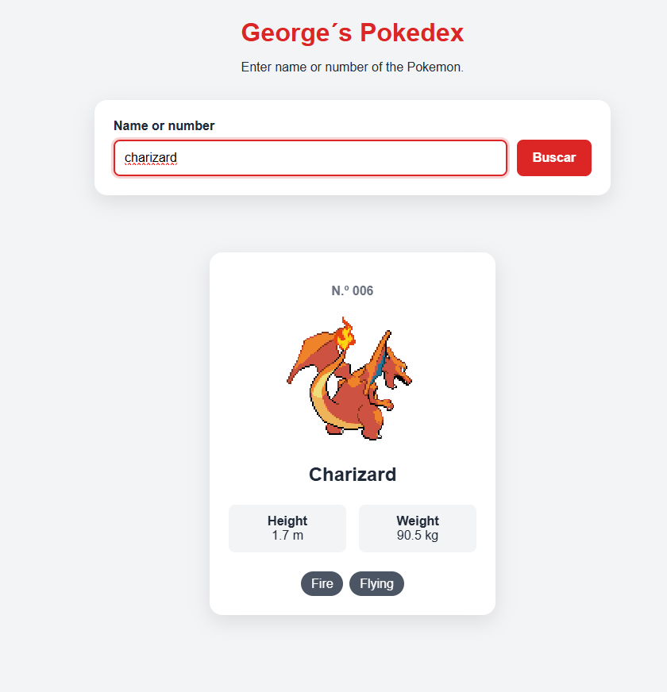


**d) Estados de carga y error.** El manejador mostrará `Loading...` antes de la petición y usará `try/catch` para controlar los fallos:

```js
mensaje.textContent = "Loading..."; 
resultado.innerHTML = "";

try {
    const pokemon = await obtenerPokemon(busqueda);
    mostrarPokemon(pokemon);
    mensaje.textContent = "";
} catch (error) {
    mensaje.textContent = error.message;
}
```
`mensaje.textContent = "Loading...";` avisa al usuario de que la consulta está en marcha. La API tarda un momento, y sin aviso parecería que la página no hace nada.

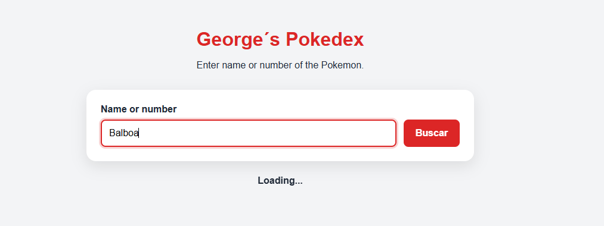

## 3 Carga de 151 Pokemons

### 2.1 Cambios respecto al punto de partida

La mini-Pokédex pedía un solo Pokémon cada vez, según lo que escribía el usuario. Ahora la aplicación descarga de una vez los 151 Pokémon de la primera generación y los guarda en un array (`listaPokemon`). No hay ningún nombre ni dato escrito a mano: todo viene de PokéAPI.

La función `obtenerPokemon` se reutiliza tal cual, porque la URL acepta tanto un nombre como un número (`/pokemon/25` y `/pokemon/pikachu` devuelven lo mismo).

### 2.2 Consulta y transformación de los datos

**a) Lista de identificadores del 1 al 151.** Con `Array.from` se crea el array sin escribirlo a mano. El índice `i` empieza en 0, por eso se suma 1:

```js
const pokeIds = Array.from({ length: 151 }, (_, i) => i + 1);
```

**b) Una petición por identificador.** Con `map()` se llama a `obtenerPokemon` por cada número. Como la función es `async`, el resultado no son Pokémon sino 151 promesas, y las 151 peticiones salen casi a la vez en lugar de una detrás de otra:

```js
const promesas = pokeIds.map((id) => obtenerPokemon(id));
```
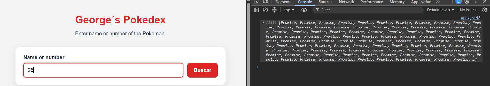

**c) Esperar a todas.** `Promise.all` espera a que lleguen las 151 y devuelve los resultados en el mismo orden en que se pidieron, aunque las respuestas lleguen mezcladas:

```js
const listaPokemon = await Promise.all(promesas);
```
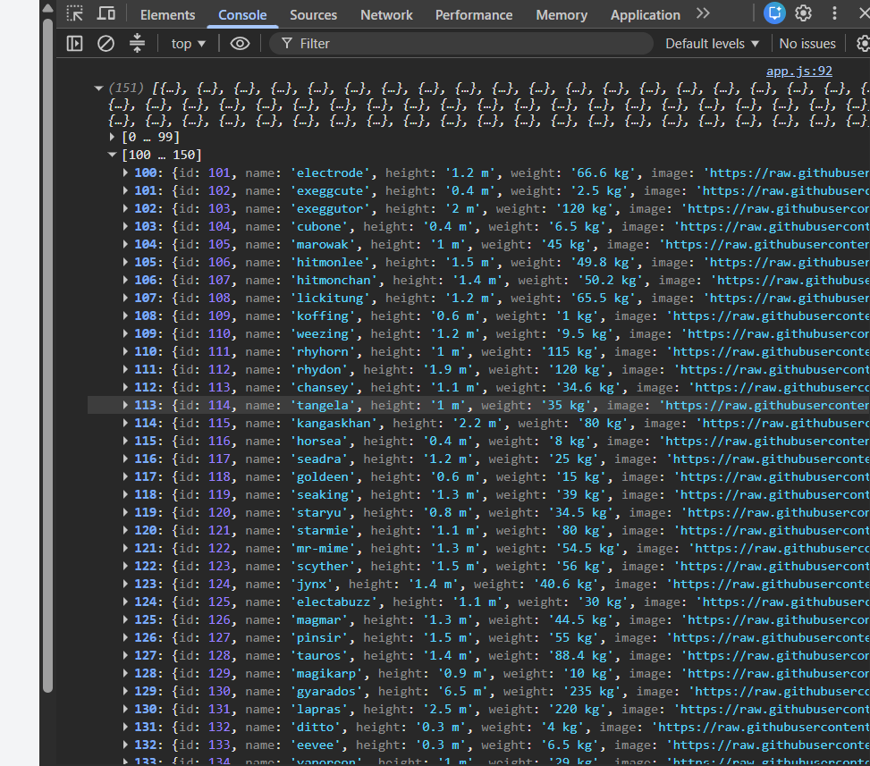

Todo está dentro de una función `async` llamada `cargarPokemon`, porque `await` solo se puede usar dentro de funciones `async`.

**d) Datos que se guardan de cada Pokémon.** Además de los de la tarjeta, ya guardo los que necesitará el panel de detalles, para no tener que hacer peticiones nuevas cuando el usuario lo abra:

```js
return {
    id: datos.id,
    name: datos.name,
    height: datos.height / 10 + " m",
    weight: datos.weight / 10 + " kg",
    image: datos.sprites.back_default,
    image2: datos.sprites.front_default,
    typess: datos.types.map(({ type }) => type.name),
    baseExp: datos.base_experience,
    abilities: datos.abilities.map(({ ability }) => ability.name),
    stats: datos.stats.map(({ base_stat, stat }) => ({
        name: stat.name,
        value: base_stat,
    })),
};
```
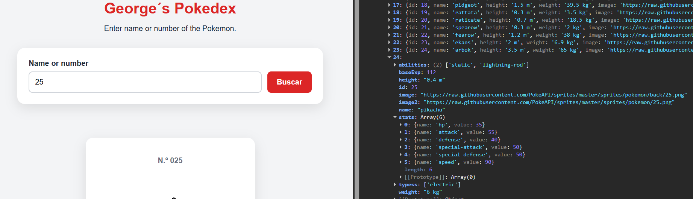

## 4. Construcción de las tarjetas

### 4.1 Datos seleccionados de PokéAPI

Cada tarjeta muestra número, nombre, imagen, altura, peso y tipos. Las unidades se convierten al guardar el dato: la API da la altura en decímetros y el peso en hectogramos, y al dividir entre 10 salen metros y kilogramos.

### 4.2 Generación dinámica de las tarjetas

**Separar construir de mostrar.** La función `mostrarPokemon` usaba `resultado.innerHTML = ...`, que sustituye todo el contenido. Si se llamara 151 veces solo quedaría la última tarjeta. Por eso creé `crearTarjeta`, que **devuelve** el HTML de una tarjeta como texto con `return` y no toca la página:

```js
const crearTarjeta = (pokemon) => {
    const tiposHTML = pokemon.typess
        .map((type) => `<span class="tipo">${type}</span>`)
        .join("");

    return `<article class="pokemon"> ... </article>`;
};
```

Con ella, las 151 tarjetas se generan y se insertan de una vez:

```js
const tarjetasHTML = listaPokemon.map((pokemon) => crearTarjeta(pokemon)).join("");
resultado.innerHTML = tarjetasHTML;
```

- `map()` convierte cada Pokémon en el HTML de su tarjeta.
- `join("")` junta los 151 trozos en un solo texto, sin las comas que añade un array al convertirse en texto.
- `formatearId` está fuera de `crearTarjeta` para no recrearla en cada tarjeta.

`mostrarPokemon` se mantiene de forma temporal con una sola línea (`resultado.innerHTML = crearTarjeta(pokemon)`) para que la búsqueda por formulario siga funcionando hasta que se sustituya por el filtrado de las 151.

### 4.3 Cuadrícula adaptable

Con el CSS de la mini-Pokédex, `.resultado` usaba `display: flex`, que coloca todo en una sola fila. Con 151 tarjetas, al estar centradas en una fila mucho más ancha que la pantalla, las primeras quedaban cortadas por la izquierda sin poder llegar a ellas con scroll (la primera visible era la nº 73). Lo cambié a una cuadrícula:

```css
.resultado {
    display: grid;
    grid-template-columns: repeat(auto-fill, minmax(220px, 1fr));
    gap: 1.5rem;
}
```

`auto-fill` con `minmax(220px, 1fr)` hace que el navegador calcule cuántas columnas caben, así que se adapta a escritorio y móvil sin escribir media queries. También ensanché `.contenedor` a 1200px, limité `.buscador` a 650px y cambié la imagen a `width: 100%; max-width: 180px`.

### 4.4 Cambio de sprite al pasar el cursor

Cada tarjeta lleva dos imágenes, la de espaldas (`image`, `back_default`) y la de frente (`image2`, `front_default`), con una clase común y otra específica:

```html


```

El intercambio se hace solo con CSS, sin peticiones a la API, porque las dos URL ya están en el objeto. Una de las dos siempre está oculta, así que nunca se ven a la vez:

```css
.pokemon__imagen--frente { display: none; }
.pokemon:hover .pokemon__imagen--espalda { display: none; }
.pokemon:hover .pokemon__imagen--frente { display: inline; }
```

El `:hover` está en la tarjeta y no en la imagen. Si estuviera en la imagen de espaldas y la ocultara, el cursor dejaría de estar sobre ella, volvería a aparecer y parpadearía sin parar.

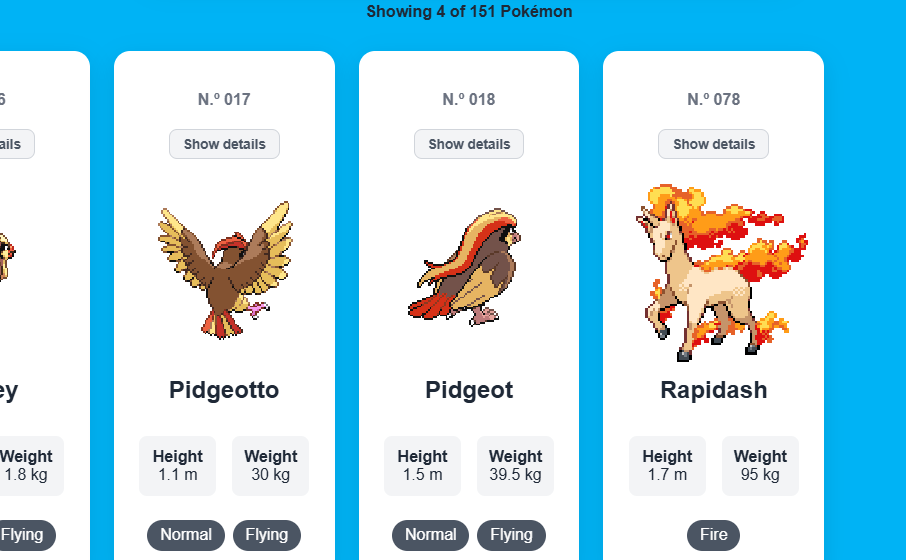

### 4.5 Animación: el Pokémon se gira y crece

Al pasar el cursor, la imagen de frente aparece girando y agrandándose. La tarjeta no se mueve; solo cambia la imagen:

```css
@keyframes girar {
    from { transform: perspective(400px) rotateY(90deg) scale(1); }
    to   { transform: perspective(400px) rotateY(0deg) scale(1.4); }
}

.pokemon:hover .pokemon__imagen--frente {
    display: inline;
    animation: girar 0.4s ease forwards;
}
```

- `rotateY` gira la imagen sobre un eje vertical y `perspective` le da sensación de profundidad.
- Giro y crecimiento están en la misma animación porque los dos usan `transform` y, por separado, uno anularía al otro.
- `forwards` mantiene la imagen en el estado final mientras el cursor siga encima.
- Con `@media (prefers-reduced-motion: reduce)` se desactiva la animación para quien tiene activada la opción de reducir movimiento en su sistema.

## 5. Clase `Pokemon` en `js/Pokemon.js`

La tarea exige que el proyecto tenga un archivo `Pokemon.js` con una clase que represente los datos de cada Pokémon. Hasta ahora `obtenerPokemon` hacía dos cosas: pedir los datos a la API y transformarlos con un `return { ... }` que creaba un objeto anónimo. Separé esas responsabilidades:

- `obtenerPokemon` solo consulta la API.
- La clase `Pokemon` recibe la respuesta en bruto y se queda con los datos que necesita la aplicación.

```js
class Pokemon {
    constructor(datos) {
        this.id = datos.id;
        this.name = datos.name;
        this.height = datos.height / 10 + " m";   
        this.weight = datos.weight / 10 + " kg";   
        this.image = datos.sprites.back_default;   
        this.image2 = datos.sprites.front_default; 
        this.typess = datos.types.map(({ type }) => type.name);
        this.baseExp = datos.base_experience;
        this.abilities = datos.abilities.map(({ ability }) => ability.name);
        this.stats = datos.stats.map(({ base_stat, stat }) => ({
            name: stat.name,
            value: base_stat,
        }));
    }
}
```

- `class Pokemon` declara el molde y `constructor(datos)` se ejecuta automáticamente al crear un objeto con `new`.
- `this` es el objeto que se está creando: `this.id = datos.id` guarda el dato en él.
- Es la misma transformación que ya hacía en el `return`, solo que ahora vive en un único sitio.

En `obtenerPokemon`, todo el bloque `return { ... }` se sustituye por una línea:

```js
return new Pokemon(datos);
```

Cargo el archivo en `index.html`. El navegador ejecuta los scripts de arriba abajo y `app.js` usa la clase:

```html
<script src="js/Pokemon.js"></script>
<script src="js/app.js"></script>
```
## 6. Búsqueda y filtrado

La búsqueda ya no consulta la API. Como los 151 Pokémon están guardados en el array `todosLosPokemon`, basta con filtrar ese array, y la respuesta es inmediata.

```js
const filtrar = () => {
    if (todosLosPokemon.length === 0) return;

    const texto = inputBusqueda.value.trim().toLowerCase();

    const filtrados = todosLosPokemon.filter((pokemon) => {
        const coincideTexto = pokemon.name.includes(texto) || String(pokemon.id) === texto;
        const coincideTipo = tiposSeleccionados.every((tipo) => pokemon.typess.includes(tipo));
        return coincideTexto && coincideTipo;
    });

    pintarTarjetas(filtrados);
};
```

- `filter()` devuelve solo los Pokémon que cumplen la condición.
- `name.includes(texto)` permite buscar por fragmento: `char` encuentra Charmander, Charmeleon y Charizard.
- `String(pokemon.id) === texto` compara el número como texto, porque `.value` siempre devuelve texto.
- Si el campo está vacío, `includes("")` es `true` para todos y se muestran los 151.

La función `pintarTarjetas` dibuja el resultado y avisa al usuario:

```js
const pintarTarjetas = (lista) => {
    if (lista.length === 0) {
        resultado.innerHTML = "";
        mensaje.textContent = "No Pokémon match your search.";
        return;
    }

    resultado.innerHTML = lista.map((pokemon) => crearTarjeta(pokemon)).join("");
    mensaje.textContent = `Showing ${lista.length} of ${todosLosPokemon.length} Pokémon`;
};
```

`filtrar` se ejecuta al escribir (`input`) y al enviar el formulario (`submit`, con `preventDefault` para que la página no se recargue):

```js
inputBusqueda.addEventListener("input", filtrar);

formulario.addEventListener("submit", (evento) => {
    evento.preventDefault();
    filtrar();
});
```
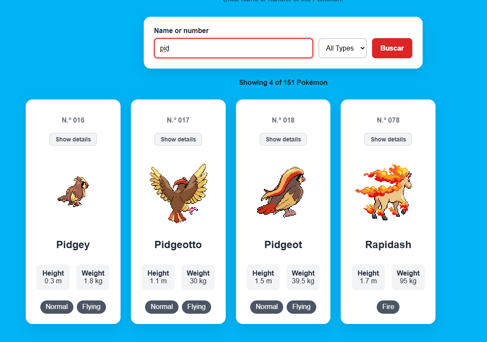

## 7. Panel de detalles

Cada tarjeta tiene un botón "Show details". Al pulsarlo se abre un panel con los datos que ya guardé de cada Pokémon (experiencia base, habilidades y estadísticas), sin hacer ninguna petición nueva.

**a) El panel.** Uso la etiqueta `<dialog>`, que trae de serie el fondo oscuro, el foco y el cierre con la tecla Esc:

```html
<dialog id="panel-detalles" class="panel" aria-labelledby="panel-titulo">
  <button type="button" class="panel__cerrar" aria-label="Close details">✕</button>
  <div id="panel-contenido"></div>
</dialog>
```

**b) Delegación de eventos.** Las tarjetas se crean y se borran continuamente, así que no pongo un listener en cada botón. Pongo uno solo en el contenedor y con `closest()` compruebo si el clic fue en un botón de detalles:

```js
resultado.addEventListener("click", (evento) => {
    const boton = evento.target.closest(".pokemon__detalle");
    if (!boton) return;

    const id = Number(boton.dataset.id);
    const pokemon = todosLosPokemon.find((p) => p.id === id);
    if (!pokemon) return;

    panelContenido.innerHTML = crearPanel(pokemon);
    panel.showModal();
});
```

- `data-id` en el botón guarda el identificador del Pokémon, y `dataset.id` lo lee como **texto**, por eso se convierte con `Number()` antes de compararlo.
- `find()` devuelve el primer Pokémon que cumple la condición.
- `showModal()` abre el `<dialog>` como ventana modal.

**c) Estadísticas con barras.** Cada estadística se dibuja con una barra cuyo ancho es proporcional a su valor. 255 es el máximo posible de una estadística base:

```js
<span style="width: ${Math.min(100, (value / 255) * 100)}%"></span>
```

**d) Cierre.** El panel se cierra con la X, haciendo clic en el fondo oscuro o con Esc:

```js
botonCerrar.addEventListener("click", () => panel.close());

panel.addEventListener("click", (evento) => {
    if (evento.target === panel) panel.close();
});
```
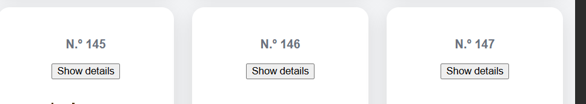
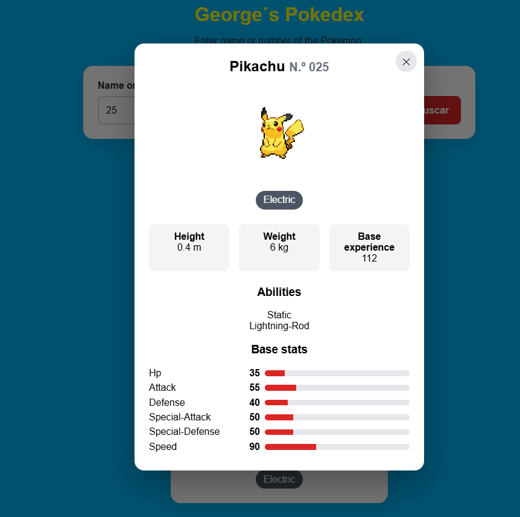

## 8. Filtro por tipos

### 8.1 Botones de tipo

Se hicieron botones tipo chips para poder marcar varios tipos, ya que la priemra generación cuenta con un máximo de dos tipos por Pokémon en algunos casos. Lo más importante veremos a continuiación para marcar o desmarcar.

```js
const rellenarTipos = () => {
    const tipos = [...new Set(todosLosPokemon.flatMap((pokemon) => pokemon.typess))].sort();

    contenedorTipos.innerHTML =
        `<button type="button" class="chip chip--todos" data-tipo="all">All</button>` +
        tipos
            .map((tipo) => `<button type="button" class="chip tipo--${tipo}" data-tipo="${tipo}" aria-pressed="false">${tipo}</button>`)
            .join("");
};
```
- `flatMap` junta en una sola lista los tipos de todos los Pokémon.
- `new Set` elimina los repetidos y `sort()` los ordena.
- `aria-pressed` indica a los lectores de pantalla si el botón está activado.


### 8.2 Marcar y desmarcar

Igual que con los detalles, un solo listener en el contenedor gestiona todos los botones. Guarda los tipos marcados en el array `tiposSeleccionados`, añade o quita la clase `chip--activo` y vuelve a filtrar. El botón "All" deja el array vacío.

El filtro usa `every`, así que un Pokémon debe tener **todos** los tipos marcados: fire + flying devuelve Charizard y Moltres.

### 8.3 Solo combinaciones que existen

Para no ofrecer combinaciones que no existen (por ejemplo dragon + poison), tras cada clic se desactivan los tipos que, sumados a los marcados, no coinciden con ningún Pokémon:

```js
const actualizarChips = () => {
    contenedorTipos.querySelectorAll(".chip").forEach((chip) => {
        const tipo = chip.dataset.tipo;
        if (tipo === "all") return;

        if (tiposSeleccionados.includes(tipo)) {
            chip.disabled = false;
            return;
        }

        const combinacion = [...tiposSeleccionados, tipo];
        const hayAlguno = todosLosPokemon.some((pokemon) =>
            combinacion.every((t) => pokemon.typess.includes(t))
        );

        chip.disabled = !hayAlguno;
    });
};
```

- `some()` devuelve `true` si al menos un Pokémon cumple la condición.
- Un chip ya marcado nunca se desactiva, para poder desmarcarlo.
- Como ningún Pokémon tiene tres tipos, al marcar dos se desactivan todos los demás sin escribir esa regla.

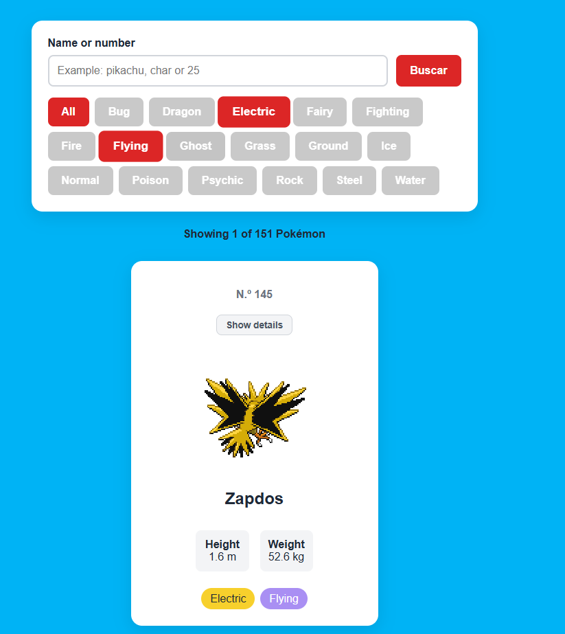

## 9. Botón de carga, estados y error

Hasta ahora los Pokémon se cargaban solos al abrir la página. Ahora la carga la inicia el usuario con el botón "Load Pokémon".

```js
const cargarPokemon = async () => {
    mensaje.textContent = "Loading Pokémon...";
    resultado.innerHTML = "";
    botonCargar.disabled = true;

    try {
        const pokeIds = Array.from({ length: 151 }, (_, i) => i + 1);
        const promesas = pokeIds.map((id) => obtenerPokemon(id));
        todosLosPokemon = await Promise.all(promesas);

        tiposSeleccionados = [];
        rellenarTipos();
        actualizarChips();
        inputBusqueda.disabled = false;
        botonCargar.textContent = "Reload Pokémon";

        filtrar();
    } catch (error) {
        todosLosPokemon = [];
        contenedorTipos.innerHTML = "";
        inputBusqueda.disabled = true;
        mensaje.textContent = "Could not connect with PokéAPI. Please try again.";
        botonCargar.textContent = "Retry";
    } finally {
        botonCargar.disabled = false;
    }
};

mensaje.textContent = "Press “Load Pokémon” to start.";
botonCargar.addEventListener("click", cargarPokemon);
```

- Si **una sola** de las 151 peticiones falla, `Promise.all` falla entero y se ejecuta el `catch`.
- `finally` se ejecuta siempre, haya éxito o error, y reactiva el botón para poder reintentar.
- Al recargar se vacían los tipos marcados, porque los botones se vuelven a crear.

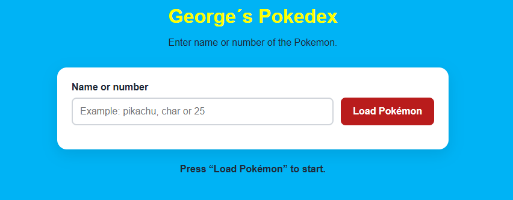
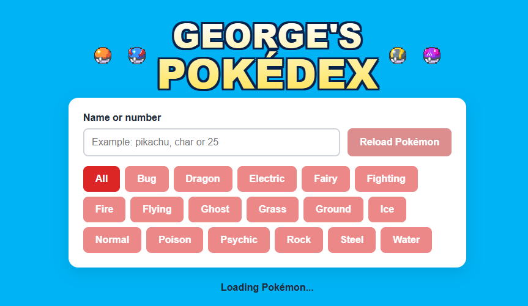